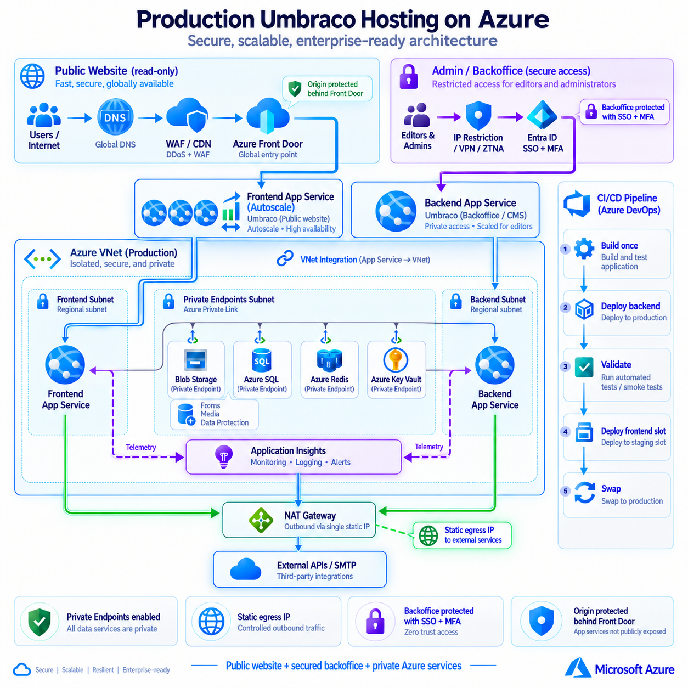
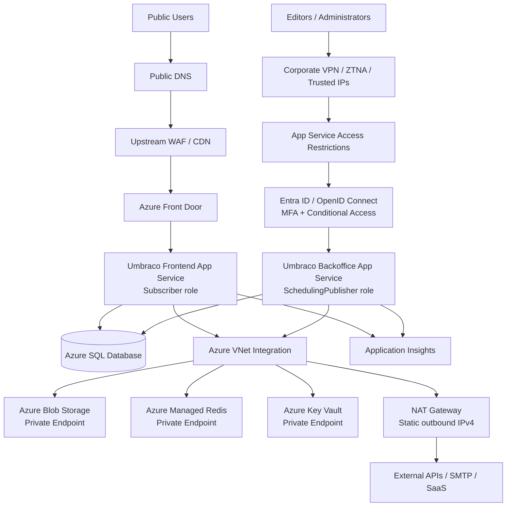
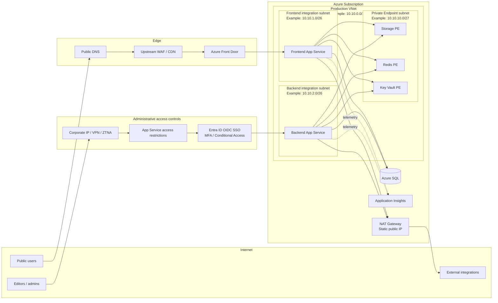

## Architecture Overview

The following reference architecture shows a production-oriented Umbraco hosting model on Microsoft Azure, designed for high-traffic websites, independent frontend scaling, secured backoffice access, private Azure services, controlled outbound networking, monitoring, and CI/CD.

<p align="center">
  
</p>

> This architecture is intentionally generic and contains no customer-specific resource names, IP addresses, domains, credentials, or subscription information.

# Production Umbraco Hosting on Azure — Reference Architecture

A practical, security-conscious reference architecture for running **Umbraco CMS on Microsoft Azure** with separate public frontend and protected backoffice/publishing roles, shared state, controlled outbound networking, Private Endpoints, edge protection, and Azure DevOps-based deployments.

> This repository is intentionally generic. It is based on a production implementation pattern, but all customer names, IP addresses, hostnames, subscription IDs, resource IDs, credentials, tenant identifiers, administrative allow-lists, and environment-specific values are removed or replaced with examples/placeholders.

## Why this repository exists

This repository is intended to help DevOps engineers, platform engineers, and Umbraco teams understand a production-grade Azure hosting pattern that supports:

- independent frontend and backoffice scaling;
- a **protected administrative plane** using network restrictions and SSO/MFA;
- shared Umbraco state across multiple App Service instances;
- Azure Front Door and upstream WAF/CDN protection;
- predictable static outbound IP using NAT Gateway;
- private access to Storage, Redis, and Key Vault;
- managed identity and centralized secret management;
- deployment safety using a build-once/deploy-many workflow;
- practical troubleshooting and validation guidance.

## Security posture at a glance

The public frontend and the Umbraco backoffice are deliberately treated differently.

| Surface | Recommended exposure | Primary controls |
|---|---|---|
| Public frontend | Internet-facing | Upstream WAF/CDN, Azure Front Door, origin restrictions, TLS, health probes |
| Umbraco backoffice | Restricted | Corporate/VPN/ZTNA IP allow-list **and** Entra ID/OpenID Connect SSO with MFA/Conditional Access |
| Kudu / SCM | Restricted | Separate access restrictions; permit only approved admin/deployment paths |
| Azure PaaS data plane | Private where practical | Private Endpoints + Private DNS |
| External outbound integrations | Controlled | VNet Integration + NAT Gateway + one static egress IPv4 |

> **Do not publish real administrative IP ranges, Entra tenant IDs, app registration IDs, Front Door IDs, or security-group names in a public fork.**

## High-level architecture



## Detailed network architecture



## Recommended backoffice security profile

For a public reference implementation, the recommended baseline is **defense in depth** rather than choosing only IP restrictions or only SSO:

1. Use a dedicated administrative hostname, for example `admin.example.com`.
2. Restrict the backend App Service to trusted corporate/VPN/ZTNA source ranges where operationally possible.
3. Configure Umbraco backoffice authentication with an external OpenID Connect provider such as Microsoft Entra ID.
4. Enforce MFA and Conditional Access in the identity provider.
5. Map identity-provider groups to least-privilege Umbraco user groups.
6. Protect the SCM/Kudu endpoint separately and validate the Azure DevOps deployment path before applying restrictive SCM rules.
7. Keep a documented break-glass process that does not depend on the same SSO path.
8. Audit sign-ins, role changes, access-restriction changes, and backoffice administrative activity.

For environments where administrators do not have stable public IP ranges, prefer **VPN/ZTNA/private access** over weakening the allow-list.

See [Backoffice security](docs/backend-security.md) for implementation options and commands.

## Core design principles

| Principle | Why it matters |
|---|---|
| Separate frontend and backend App Services | Public traffic and editorial/publishing workloads scale independently. |
| Backoffice is not treated as a normal public website | Administrative access receives stronger network and identity controls. |
| One immutable application artifact | Avoids code drift between frontend and backend roles. |
| Shared SQL, Blob, Redis, and Data Protection | Required for consistent multi-instance Umbraco behavior. |
| VNet Integration for both App Services | Enables Private Endpoint access and controlled egress. |
| Dedicated integration subnets | Keeps frontend/backend network policies independent. |
| NAT Gateway | Gives external integrations one stable source IPv4 to allow-list. |
| Private Endpoints | Removes public data-plane exposure for selected Azure PaaS services. |
| Managed identities + Key Vault | Minimizes long-lived secrets in App Service configuration. |
| Edge WAF + Azure Front Door | Adds layered TLS, WAF/CDN, health routing, and origin control. |
| SSO + MFA for backoffice | Centralizes identity lifecycle and reduces password-only administrative access. |
| Access restrictions for admin/SCM | Reduces the exposed attack surface before requests reach Umbraco. |

## Reference documentation

- [Architecture](docs/architecture.md)
- [Networking](docs/networking.md)
- [Backoffice security](docs/backend-security.md)
- [Umbraco-specific design](docs/umbraco.md)
- [Security](docs/security.md)
- [CI/CD](docs/cicd.md)
- [Operations and troubleshooting](docs/operations.md)
- [Lessons learned](docs/lessons-learned.md)
- [Cost and trade-offs](docs/cost-and-tradeoffs.md)
- [Public-repository publication checklist](PUBLICATION_CHECKLIST.md)
- [Official references](docs/references.md)

## Important implementation notes

### Shared files are not local App Service files

Do not assume App Service local files are shared between the backend and frontend. Media, shared Forms data, and Data Protection state should use shared durable services where appropriate.

### Static outbound IP requires routing through the VNet

A NAT Gateway only becomes the public source IP for App Service runtime traffic after the application routes outbound internet traffic through VNet Integration.

### Private Endpoint success is primarily a DNS problem

Applications should continue using normal service hostnames. Private DNS should resolve those hostnames to RFC1918 private IPs inside the VNet. Validate both DNS and application-layer connectivity before disabling public access.

### Backoffice security must be tested with deployment and scheduler flows

Network restrictions can unintentionally block:

- Azure DevOps deployment through the SCM/Kudu endpoint;
- health checks;
- identity-provider callback URLs;
- required self-calls to the administrative hostname;
- operational access during incidents.

Apply controls incrementally and test each path before setting the default action to deny.

### Keep exact versions explicit

Umbraco configuration keys and package behavior can differ by major version. Record the exact CMS, Forms, authentication-provider, and storage-provider versions for every real implementation.

## Example naming convention

```text
rg-umbraco-prod
vnet-umbraco-prod
snet-appsvc-frontend
snet-appsvc-backend
snet-private-endpoints
nat-umbraco-prod
pip-umbraco-prod-egress
app-umbraco-frontend-prod
app-umbraco-backoffice-prod
stumbracoprod
kv-umbraco-prod
redis-umbraco-prod
sql-umbraco-prod
```

These are examples only. Use your organization's naming and tagging standards.

## Security warning

Never publish real:

- customer or project identifiers;
- subscription/tenant IDs;
- Entra application/client IDs where disclosure is not intended;
- public or private production IPs;
- office/VPN/ZTNA allow-list ranges;
- App Service default hostnames;
- Front Door endpoint hostnames or profile IDs;
- Key Vault secret names that reveal sensitive business context;
- connection strings, API keys, certificates, or passwords;
- screenshots containing resource IDs, access tokens, account names, or security rules with real source ranges.

## Official references

- Microsoft Learn: Azure App Service access restrictions
- Microsoft Learn: Secure Azure Front Door origins
- Microsoft Learn: Microsoft Entra ID authentication for App Service
- Umbraco documentation: External login providers for backoffice users

## Acknowledgements

Special thanks to **VimalDev Vijayan** ([@Vimaldev87](https://github.com/Vimaldev87)) for his Umbraco development work and application-side collaboration that helped shape and validate this reference architecture.

## License / reuse

This repository is a technical reference. Adapt it to your organization's requirements, Azure region availability, security policies, Umbraco version, support model, and budget.
