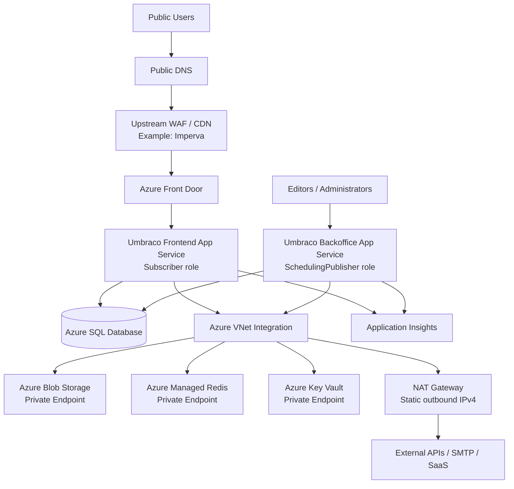
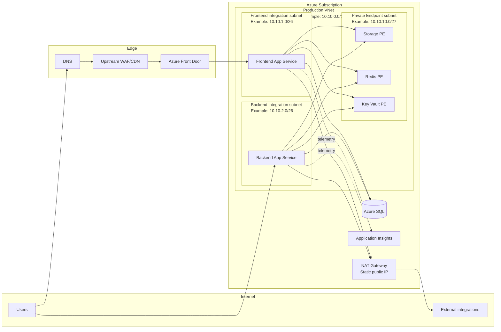

# Production Umbraco Hosting on Azure — Reference Architecture

A practical reference architecture for running **Umbraco CMS on Microsoft Azure** with separate backoffice/publishing and public frontend roles, shared state, controlled outbound networking, Private Endpoints, edge protection, and Azure DevOps-based deployments.

> This repository is intentionally generic. It is based on a real production implementation, but all customer names, IP addresses, hostnames, subscription IDs, resource IDs, credentials, and environment-specific values have been removed or replaced with examples/placeholders.

## Why this repository exists

This repository is intended to help DevOps engineers, platform engineers, and Umbraco teams understand a production-grade Azure hosting pattern that supports:

- independent frontend and backoffice scaling;
- shared Umbraco state across multiple App Service instances;
- Azure Front Door and upstream WAF/CDN protection;
- predictable static outbound IP using NAT Gateway;
- private access to Storage, Redis, and Key Vault;
- managed identity and centralized secret management;
- deployment safety using a build-once/deploy-many workflow;
- practical troubleshooting and validation guidance.

## High-level architecture



## Network architecture



## Core design principles

| Principle | Why it matters |
|---|---|
| Separate frontend and backend App Services | Public traffic and editorial/publishing workloads scale independently. |
| One immutable application artifact | Avoids code drift between frontend and backend roles. |
| Shared SQL, Blob, Redis, and Data Protection | Required for consistent multi-instance Umbraco behavior. |
| VNet Integration for both App Services | Enables Private Endpoint access and controlled egress. |
| Dedicated integration subnets | Keeps frontend/backend network policies independent. |
| NAT Gateway | Gives external integrations one stable source IPv4 to allow-list. |
| Private Endpoints | Removes public data-plane exposure for selected Azure PaaS services. |
| Managed identities + Key Vault | Minimizes long-lived secrets in App Service configuration. |
| Edge WAF + Azure Front Door | Adds layered TLS, WAF/CDN, health routing, and origin control. |

## Reference documentation

- [Architecture](docs/architecture.md)
- [Networking](docs/networking.md)
- [Umbraco-specific design](docs/umbraco.md)
- [Security](docs/security.md)
- [CI/CD](docs/cicd.md)
- [Operations and troubleshooting](docs/operations.md)
- [Lessons learned](docs/lessons-learned.md)
- [Cost and trade-offs](docs/cost-and-tradeoffs.md)
- [Public-repository publication checklist](PUBLICATION_CHECKLIST.md)

## Important implementation notes

### Shared files are not local App Service files

Do not assume App Service local files are shared between the backend and frontend. Media, shared Forms data, and Data Protection state should use shared durable services where appropriate.

### Static outbound IP requires routing through the VNet

A NAT Gateway only becomes the public source IP for App Service runtime traffic after the application routes outbound internet traffic through VNet Integration.

### Private Endpoint success is primarily a DNS problem

Applications should continue using normal service hostnames. Private DNS should resolve those hostnames to RFC1918 private IPs inside the VNet. Validate both DNS and application-layer connectivity before disabling public access.

### Keep exact versions explicit

Umbraco configuration keys and package behavior can differ by major version. Record the exact CMS, Forms, and storage-provider versions for every real implementation.

## Example naming convention

```text
rg-umbraco-prod
vnet-umbraco-prod
snet-appsvc-frontend
snet-appsvc-backend
snet-private-endpoints
nat-umbraco-prod
pip-umbraco-prod-egress
app-umbraco-frontend-prod
app-umbraco-backoffice-prod
stumbracoprod
kv-umbraco-prod
redis-umbraco-prod
sql-umbraco-prod
```

These are examples only. Use your organization's naming and tagging standards.

## Security warning

Never publish real:

- customer or project identifiers;
- subscription/tenant IDs;
- public or private production IPs;
- App Service default hostnames;
- Key Vault secret names that reveal sensitive business context;
- connection strings, API keys, certificates, or passwords;
- screenshots containing resource IDs or access tokens;
- internal firewall allow-lists or administrative IP ranges.

## License / reuse

This repository is a technical reference. Adapt it to your organization's requirements, Azure region availability, security policies, Umbraco version, support model, and budget.
