# CI/CD

## Build-once/deploy-many

The same immutable application artifact should be promoted to backend and frontend tiers.

```mermaid
flowchart LR
    C[Commit / Tag] --> B[Build + Test]
    B --> A[Versioned Artifact]
    A --> AP[Approval]
    AP --> BE[Deploy Backend]
    BE --> BV[Validate]
    BV --> FE[Deploy Frontend Slot]
    FE --> FV[Warm + Smoke Test]
    FV --> SWAP[Slot Swap / Promote]
    SWAP --> PV[Post-deploy Validation]
```

## Suggested branch strategy

A simple model works well:

- `main` — production-ready history;
- feature branches — short lived;
- pull requests — review + automated checks;
- release tags — immutable production release identifiers.

Avoid environment-specific source branches that cause code drift.

## Deployment order

For changes that can alter shared database/schema/application state:

1. approve release;
2. deploy backend first;
3. validate backoffice and migrations;
4. deploy frontend staging slot;
5. warm and smoke-test;
6. swap/promote;
7. validate all dependencies.

## Secrets

Use Azure DevOps variable groups linked to Key Vault or another approved secret mechanism. Never store production secrets in YAML.

## Rollback

Prefer rolling back the application artifact/slot first. Database rollback should be treated separately because schema changes may not be safely reversible.
